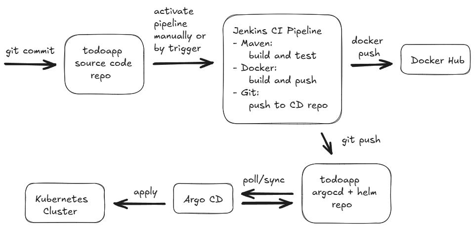

# todoapp-argocd

Config to deploy [todoapp](https://github.com/elistarkhov/todoapp) in Kubernetes using ArgoCD with Helm Templates.

Using App of Apps pattern of ArgoCD.\
Repo structure:

```
|   deployer.yaml --> parent argocd app to deploy other
|   README.md
+---apps --> argocd apps for todoapp and postgres
|       postgres.yaml
|       todoapp.yaml
+---ansible --> playbook and configs for initial server setup
|   |   ansible.cfg
|   |   inventory
|   |   server_setup.yaml
|   |   
|   \---group_vars
|       \---demo
|               vars.yaml
+---charts
    +---app --> helm templates and values for todoapp
    |   |   Chart.yaml
    |   |   values.yaml
    |   \---templates
    |           deployment.yaml
    |           service.yaml
    \---db --> helm templates and values for postgres
        |   Chart.yaml
        |   values.yaml
        \---templates
                configmap.yaml
                service.yaml
                statefulset.yaml
                volume.yaml


```

### Deployment
Requirements:

- Working k8s cluster (2 or 3 worker nodes)
- Installed ArgoCD instance with source code repo added

Create namespace and secret for apps
```
kubectl create ns todoapp

# replace db_user and db_password with valid creds
kubectl apply -f- <<EOF
apiVersion: v1
kind: Secret
metadata:
  name: todo-secret
  namespace: todoapp
type: Opaque
stringData:
  db-user: <db_user>
  db-pass: <db_password>
EOF
```

Deploy this repo in kubernetes
```
kubectl apply -n argocd -f https://raw.githubusercontent.com/elistarkhov/todoapp-argocd/refs/heads/main/deployer.yaml

```

CICD scheme
